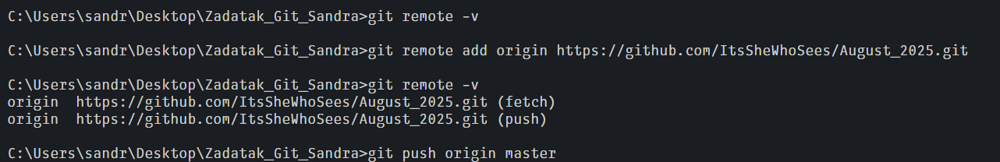
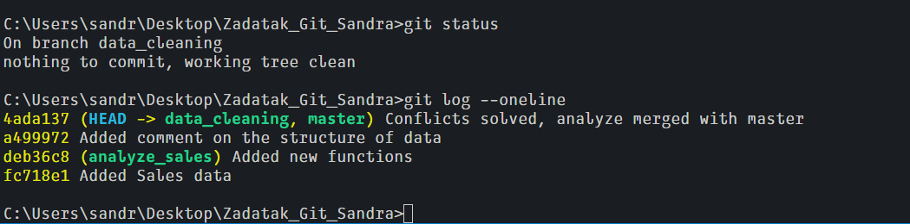

# Sales Analysis git project 
Project on the git steps using sales_data as example 

## Commits
Project commits:

1) `Added initial sales data`
2) `Added total sales and average sales functions`
3) `Added comment on the structure of data`
4) `Resolved conflicts and merged analyze-sales into main`

5) Further commands

All commits

